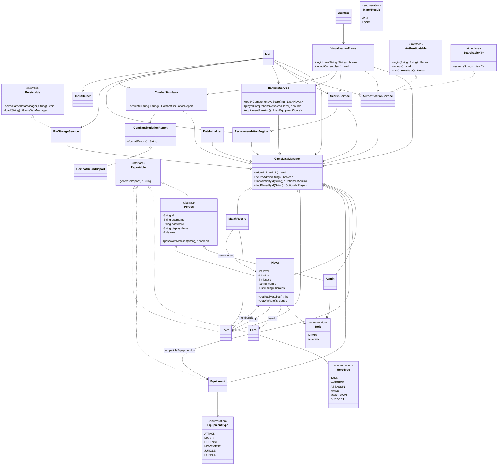

# 电子 UML 类图

源文件：`docs/class-diagram.puml`

下面的 Mermaid 类图用于在支持 Mermaid 的 Markdown 查看器中直接预览。PlantUML 文件用于正式 UML 图源文件归档。

```mermaid
classDiagram
    class Main
    class GuiMain
    class VisualizationFrame {
        +loginUser(String, String) boolean
        +logoutCurrentUser() void
    }
    class CombatSimulationReport {
        +formatReport() String
    }
    class CombatRoundReport

    class Reportable {
        <<interface>>
        +generateReport() String
    }
    class Person {
        <<abstract>>
        -String id
        -String username
        -String password
        -String displayName
        -Role role
        +passwordMatches(String) boolean
    }
    class Admin
    class Player {
        -int level
        -int wins
        -int losses
        -String teamId
        -List~String~ heroIds
        +getTotalMatches() int
        +getWinRate() double
    }
    class Hero
    class Equipment
    class Team
    class MatchRecord
    class Role {
        <<enumeration>>
        ADMIN
        PLAYER
    }
    class HeroType {
        <<enumeration>>
        TANK
        WARRIOR
        ASSASSIN
        MAGE
        MARKSMAN
        SUPPORT
    }
    class EquipmentType {
        <<enumeration>>
        ATTACK
        MAGIC
        DEFENSE
        MOVEMENT
        JUNGLE
        SUPPORT
    }
    class MatchResult {
        <<enumeration>>
        WIN
        LOSE
    }

    class Authenticatable {
        <<interface>>
        +login(String, String) Person
        +logout() void
        +getCurrentUser() Person
    }
    class Searchable~T~ {
        <<interface>>
        +search(String) List~T~
    }
    class Persistable {
        <<interface>>
        +save(GameDataManager, String) void
        +load(String) GameDataManager
    }
    class GameDataManager {
        +addAdmin(Admin) void
        +deleteAdmin(String) boolean
        +findAdminById(String) Optional~Admin~
        +findPlayerById(String) Optional~Player~
    }
    class AuthenticationService
    class SearchService
    class RankingService {
        +topByComprehensiveScore(int) List~Player~
        +playerComprehensiveScore(Player) double
        +equipmentRanking() List~EquipmentScore~
    }
    class RecommendationEngine
    class CombatSimulator {
        +simulate(String, String) CombatSimulationReport
    }
    class FileStorageService
    class DataInitializer
    class InputHelper

    Reportable <|.. Person
    Reportable <|.. Hero
    Reportable <|.. Equipment
    Reportable <|.. Team
    Person <|-- Admin
    Person <|-- Player

    Authenticatable <|.. AuthenticationService
    Searchable <|.. SearchService
    Persistable <|.. FileStorageService

    Main --> GameDataManager
    Main --> AuthenticationService
    Main --> SearchService
    Main --> RankingService
    Main --> RecommendationEngine
    Main --> CombatSimulator
    Main --> FileStorageService
    Main --> InputHelper

    GuiMain --> VisualizationFrame
    VisualizationFrame --> GameDataManager
    VisualizationFrame --> AuthenticationService
    VisualizationFrame --> SearchService
    VisualizationFrame --> RankingService
    VisualizationFrame --> CombatSimulator

    GameDataManager o-- Player
    GameDataManager o-- Admin
    GameDataManager o-- Hero
    GameDataManager o-- Equipment
    GameDataManager o-- Team
    GameDataManager o-- MatchRecord

    Player --> Role
    Player --> Hero : heroIds
    Player --> Team : teamId
    Admin --> Role
    Hero --> HeroType
    Hero --> Equipment : compatibleEquipmentIds
    Equipment --> EquipmentType
    Team --> Player : memberIds
    MatchRecord --> Team
    MatchRecord --> Player : hero choices

    SearchService --> GameDataManager
    SearchService --> RecommendationEngine
    RankingService --> GameDataManager
    RecommendationEngine --> GameDataManager
    CombatSimulator --> GameDataManager
    CombatSimulator --> CombatSimulationReport
    CombatSimulationReport o-- CombatRoundReport
    AuthenticationService --> GameDataManager
    FileStorageService --> GameDataManager
    DataInitializer --> GameDataManager
```
